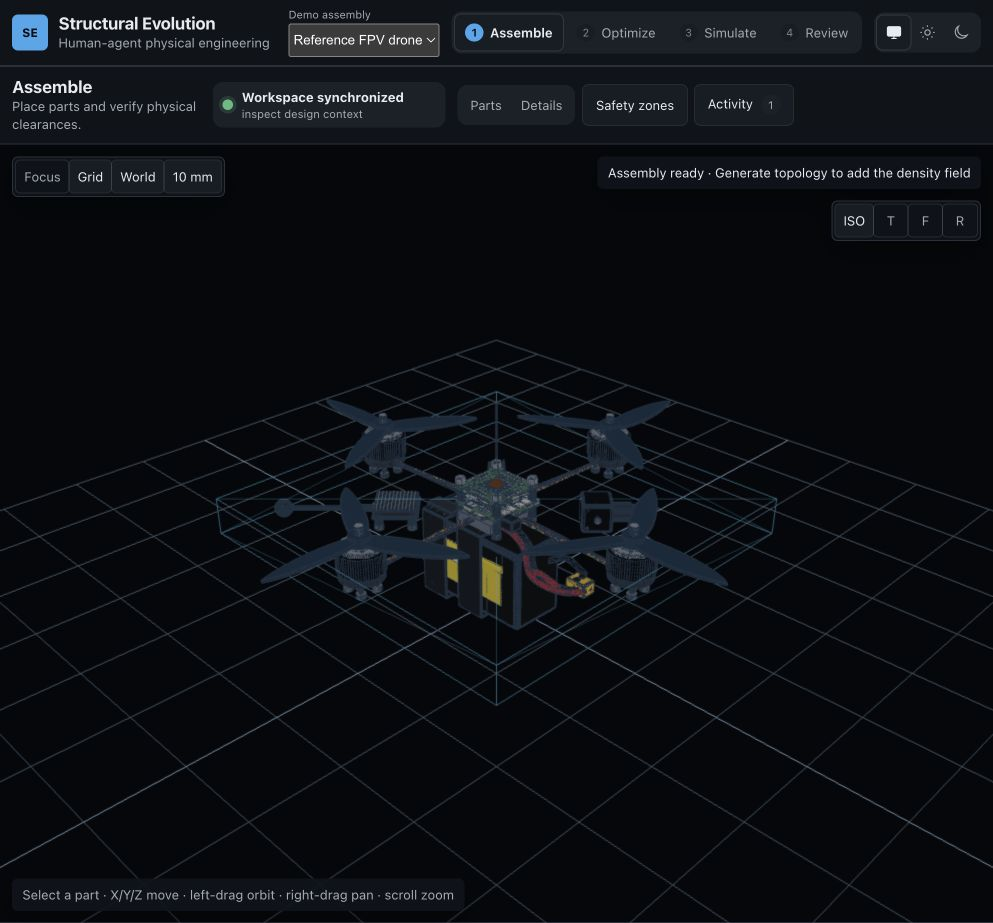

# Structural Evolution

Structural Evolution is a browser-native human-agent physical-engineering workbench. An AI agent uses typed WebMCP tools against the same live design state that a human supervises: the visible assembly, constraints, topology candidate, evidence, and decision boundary are shared rather than inferred from screenshots.

[Open the public demo](https://webmcp-structural-evolution.vercel.app) · [View the public repository](https://github.com/SebastianBoehler/webmcp-structural-evolution) · [View the Devpost draft](https://devpost.com/software/structural-evolution) · [Read the demo-video script](docs/hackathon/demo-video-script.md)



## What works today

- A public, credential-free dashboard for a reference FPV drone and an SE-6 cobot assembly, with an editable shared 3D view and workflow steps for assembly, optimization, simulation, and review.
- Typed WebMCP tools for inspecting the exact active design context, selecting an approved typed assembly, generating a topology candidate, comparing eligible candidates, inspecting the component library, staging an import for human review, and moving a permitted component in the shared layout.
- Browser-local topology work in a module worker with Rust/Wasm, protected volumes, named load cases, connected load paths, immutable receipts, and explicit stale-state handling after an edit.
- A review surface that keeps agent prediction, output/evidence, plan state, and human authority separate. Component imports remain staged until human approval; an agent cannot promote a candidate or authorize manufacturing export.
- Separate raw verification routes exist for browser engineering gates. They are not the product demo; the shared dashboard is the judge-facing product.

Topology output in the interactive dashboard is an **interactive estimate**. It is useful for a bounded design review, but it is not manufacturing approval, certified analysis, flight approval, or a claim of general CAD generation.

## How it is built

The static Vite + React + TypeScript application renders the shared scene with Three.js. The dashboard detects WebGPU capability, uses same-origin module workers for interactive topology work, and dynamically loads a Rust/Wasm reference solver. WebMCP tools register page-locally through `document.modelContext.registerTool`, with bounded JSON schemas and read-only/untrusted-content annotations. There is no application backend, account system, remote solver, or durable project storage in this release.

The agent sees typed facts such as the active revision, protected volumes, locks, and eligible next actions. State-changing operations make visible, bounded changes; imported assets wait for a human review; comparison only accepts exact non-stale candidates; and acceptance/promotion is human-only.

## Browser requirements

- The public dashboard works without credentials in a current desktop browser. WebGPU availability is detected and surfaced; a compatible adapter/device is needed for WebGPU-specific paths.
- To invoke the agent tools, use a secure-context WebMCP client. The submission was tested with the ChatGPT/Codex in-app browser with WebMCP.
- If `document.modelContext` is unavailable, the dashboard states that WebMCP is unavailable instead of pretending agent tools are active. The human-facing workbench remains usable.

## Run locally

Requires Node `24.19.0` and pnpm `10.15.0` (both are pinned by the repository).

```sh
pnpm install
pnpm dev
pnpm test:run
pnpm build
```

`pnpm build` runs TypeScript checking, the Vite production build, and the mechanism-solver build check. `pnpm check` is the broader local check and also rebuilds the reference Wasm package and runs the Rust tests.

## Judge demo flow

1. Open the [public demo](https://webmcp-structural-evolution.vercel.app); no sign-in is required. Select **Reference FPV drone** if it is not already selected.
2. In a WebMCP-enabled client, ask the agent to inspect the current design context, then select the approved reference-drone assembly. The shared 3D world updates visibly.
3. Ask the agent to generate a balanced topology candidate. Open **Review** to inspect the action receipt and the boundary between agent intent, the interactive estimate, and human authority.
4. Confirm that no candidate is automatically accepted or promoted. See the [paste-ready prompts and timed storyboard](docs/hackathon/demo-video-script.md).

The production screenshots show the actual shared dashboard states used in this flow: [assembly synchronized](docs/submission/screenshots/01-agent-synchronized-assembly.png), [ready to optimize](docs/submission/screenshots/02-agent-ready-to-optimize.png), and [human evidence review](docs/submission/screenshots/03-human-evidence-review.png).

## Limitations

- Approved templates and bounded typed operations are supported; free-form B-rep/STEP synthesis from natural language is not.
- The interactive solver is a deterministic sparse-SIMP lattice estimate, not continuum FEA, CFD, thermal validation, fatigue analysis, contact/kinematics, experimental validation, or a manufacturing decision.
- The release has no accounts, collaboration server, durable project persistence, remote jobs, or arbitrary external CAD ingestion. A staged component import still requires human review.
- WebMCP availability depends on the browser/client exposing `document.modelContext`; WebGPU availability depends on the local browser and device.

## License and notices

This repository is licensed under [Apache-2.0](LICENSE). See [THIRD_PARTY_NOTICES.md](THIRD_PARTY_NOTICES.md) for third-party notices.
